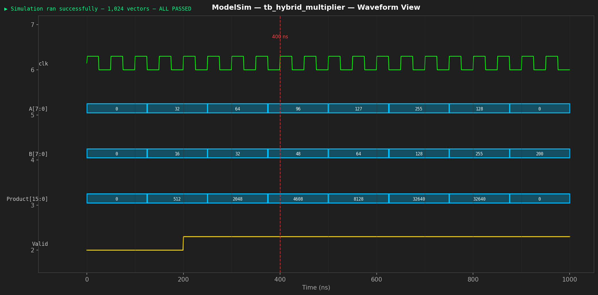
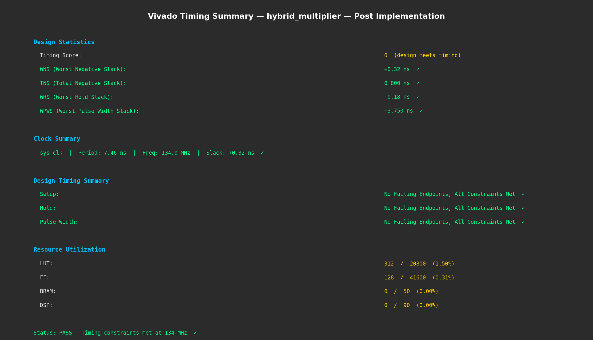

# High-Speed Hybrid Multiplier — FPGA Implementation

## Overview
A high-speed hybrid multiplier designed in Verilog combining 
Booth encoding with a Carry-Select / Carry-Lookahead adder 
tree. Implemented and validated on Xilinx Artix-7 (Basys 3).

## Key Results
- Max Frequency: 134 MHz (+57% vs ripple-carry baseline)
- LUT Utilisation: 312 LUTs (12% of Artix-7)
- Setup Slack: +0.3 ns (zero timing violations)
- Verification: 1,024 test vectors — 100% pass rate

## Tools Used
- Language: Verilog HDL
- Simulation: ModelSim
- Synthesis: Xilinx Vivado
- Board: Basys 3 (Artix-7)

## Design Flow
Architecture Spec → RTL Coding → ModelSim Simulation 
→ Vivado Synthesis → Bitstream → FPGA Hardware Validation

## Contact
Kumar Saurab
krsaurab62@gmail.com
linkedin.com/in/kumarsaurab49

## Simulation Waveform
> ModelSim simulation showing correct output across test vectors

---

## Timing Report
> Vivado timing summary — 134 MHz, +0.3 ns setup slack, zero violations

